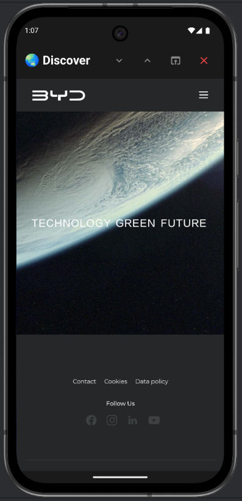

# 🌐 Discover - Random Links Discovery App  
A modern web application that helps you discover amazing links.  
Features include random link loading, view tracking, likes/dislikes functionality, and the ability to add new websites.  
We host the backend locally using reproducible containers.



## Avoid Implicit Personalized Recommendation Algorithms

A social media website with no personalized recommendation algorithms. So no more echo chamber radicalization.

There are two ways to end personalized recommendation algorithms:

1. Block user data. No user data means no user personalization.
2. No recommendation algorithm. User data is not used for implicit (without user choice like in subscriptions) personalization.

Any of the two is sufficient. My discover website does both.

Discover something new everyday. Good mood and learning ahead! 

## Background 

It is like tiktok for web links.

Completely self reliant and you can share links with the whole world, upvote them, downvote them, and it shows all counts including visits. To prevent abuse, bad links are automatically removed if they get many downvotes that are more than 80% of total votes.

This is my contribution so you don't use personalized recommendation algorithms social media. They cause echo chamber radicalization.

Let's go back to before 2005, before EdgeRank was released. 

## Local testing
```
npx serve . -l 44631
```

## Manually approve submitted links regularly
When recreating the database change the following value.
```
"reviewStatus": 0
```
to
```
"reviewStatus": 1
```

## Format code in VS Codium  
```
Ctrl+Shift+I
```
